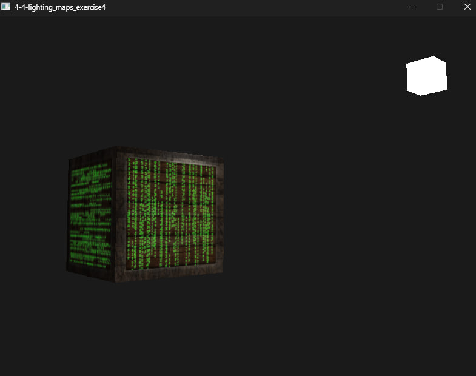
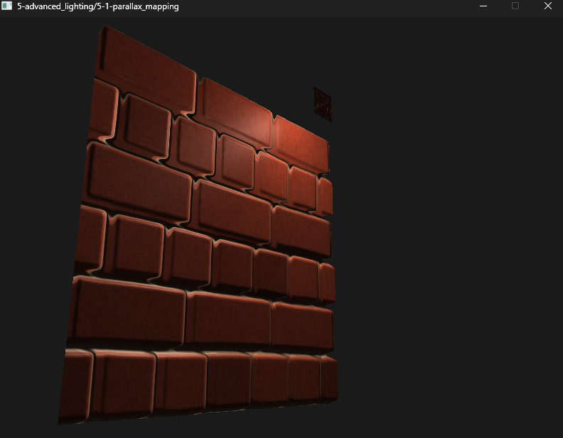
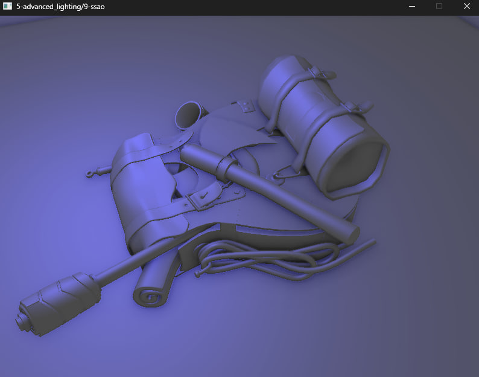
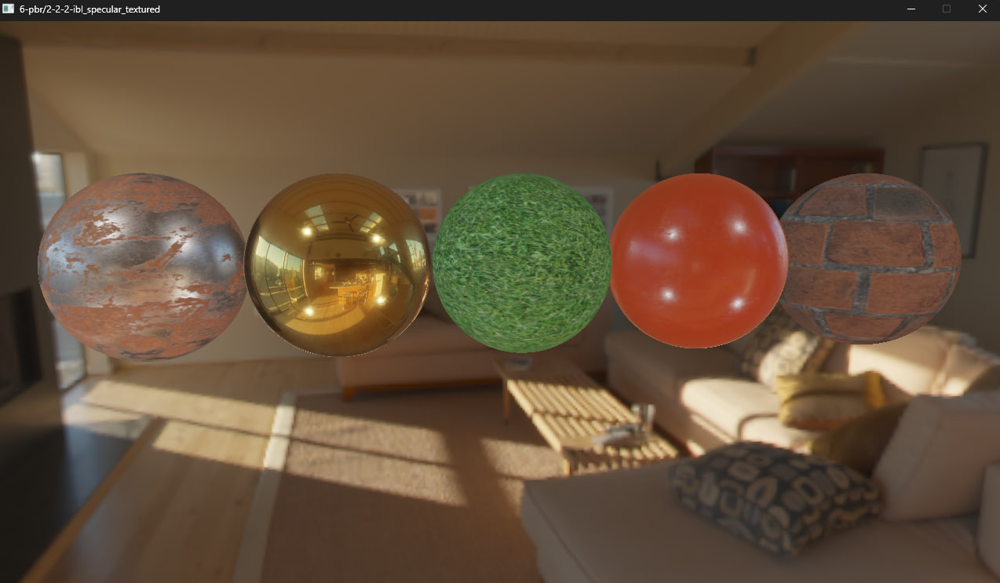
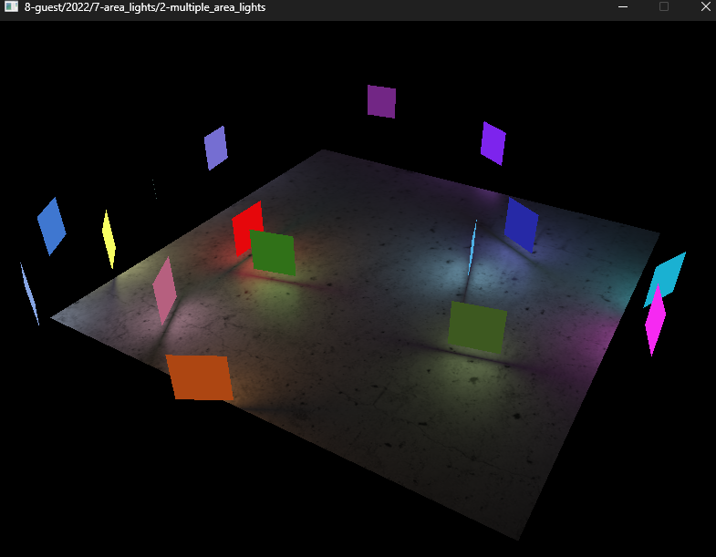

# LearnOpenGL
Code repository of all OpenGL chapters from the book and its accompanying website.

Some things fixed. 🔨

    Opengl 430; SDL3; glm; glfw3; Freetype;

 
 
 
 
 

<!-- 
```js
// rename
let folders = fs.readdirSync(`.`)
folders.map(e => fs.rename(e, e.replaceAll(`.`, `-`), console.log))
// create cmake files
folders.forEach(folder => {
	let files = fs.readdirSync(path.resolve(`./${folder}`)).filter(f => !f.endsWith(`.cpp`) && !f.endsWith(`.hpp`) && !f.endsWith(`.h`))
	let content = [`project("${folder}")`,`add_executable("${folder}_executable" "main.cpp")`,`include_directories("../../includes")`,`target_link_libraries("${folder}_executable" PRIVATE "\$\{LIBRARIES\}")`,...files.map(f => `configure_file(${f} ${f} COPYONLY)`)]
	fs.writeFileSync(path.resolve(folder, `CMakeLists.txt`),content.join(`\n`)
	)
})

//folders.forEach(f=> fs.rm(path.resolve(f,`CMakeLists.txt`)))
``` -->